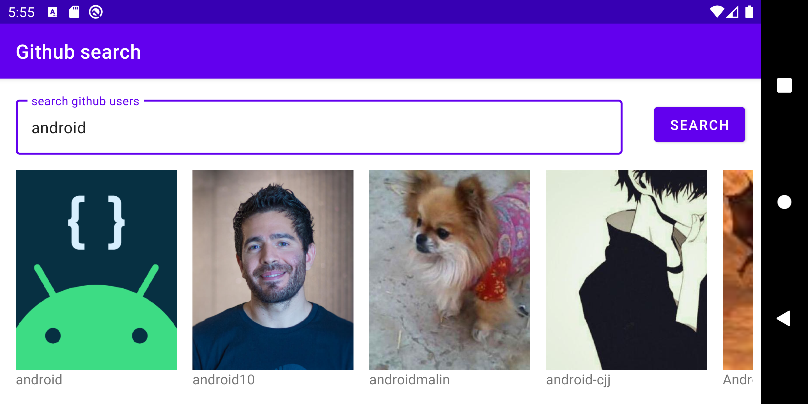

Showmax Search
==============

this project was written as a sample project to Android Crashcourse presentation showcasing one possible way of how quickly to setup application, which interacts with REST API, in this case [Github Search Users API](https://docs.github.com/en/free-pro-team@latest/rest/reference/search#search-users) and displaying content in UI.

Minimum usage of third-party libs w/ exception of:

- Retrofit - for API communication purposes
- Coil - Image loading library

App takes advantage of google ViewModel to avoid lifecycle issues and store state and view observe ViewModel LiveData. Retrofit uses coroutines to do it's job asynchronously.

